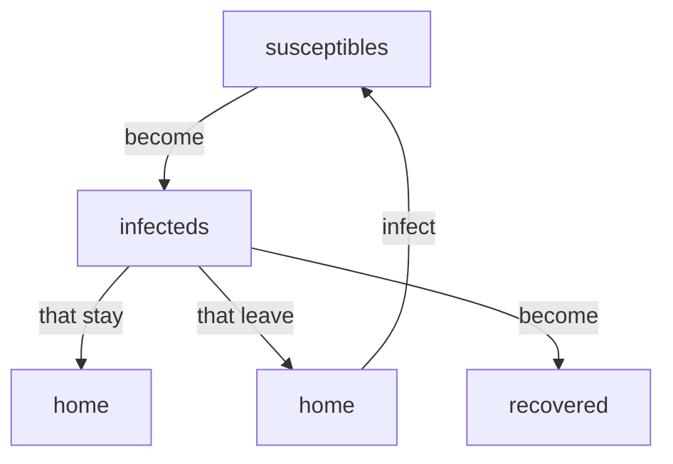

# ksim


```mermaid
flowchart TD
a1[susceptibles] -- become -->b1[infecteds]
b1 -- that stay -->d1[home]
b1 -- that leave -->e1[home]
e1 -- infect -->a1
b1 -- become -->c1[recovered]
```

```r
init_infecteds <- 
```
