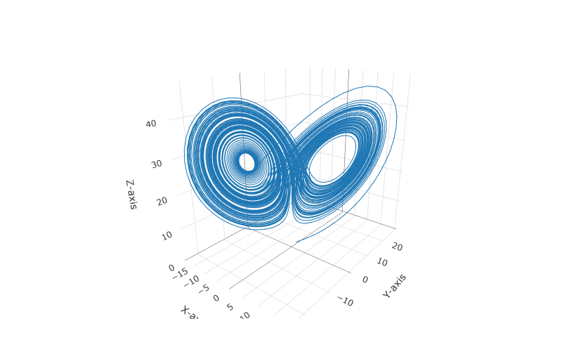

Lorenz System
================
Benjamin Panny

The Lorenz equations are a system of ordinary differential equations
(ODEs), not partial differential equations (PDEs). They are used to
model atmospheric convection and are famous for exhibiting chaotic
behavior. The equations are given by

$$
\begin{align}
\frac{dx}{dt} &= \sigma(y - x), \quad \text{(1)} \\
\frac{dy}{dt} &= x(\rho - z) - y, \quad \text{(2)} \\
\frac{dz}{dt} &= xy - \beta z. \quad \text{(3)}
\end{align}
$$

### Parameter Explanations:

- $\sigma$ (sigma): This is the Prandtl number, which represents the
  ratio of the viscous diffusion rate and the thermal diffusion rate.
  It’s a physical parameter in the system, often set to 10 in the Lorenz
  model.

- $\rho$ (rho): This represents the Rayleigh number, which is a measure
  of the buoyancy-driven flow in the system. It reflects the temperature
  difference driving the convection. In the Lorenz model, it’s often set
  to 28, but changing this value can lead to different behaviors in the
  system.

- $\beta$ (beta): This parameter is related to the physical dimensions
  of the system, particularly the aspect ratio of the convective cells.
  It is usually set to $\frac{8}{3}$ in the Lorenz model.

### Explanation of Equations:

- **Equation (1)** represents the rate of change of the velocity of the
  fluid motion (x-component).

- **Equation (2)** describes the temperature variation in the vertical
  direction (y-component).

- **Equation (3)** shows the deviation of the vertical temperature
  profile from linearity (z-component).

These equations together form a simplified model of atmospheric
convection and are known for their chaotic solutions for certain
parameter values, illustrating what is known as the Lorenz attractor in
chaos theory.

``` r
library(deSolve)
```

    ## Warning: package 'deSolve' was built under R version 4.3.2

``` r
library(plotly)
```

    ## Warning: package 'plotly' was built under R version 4.3.2

    ## Loading required package: ggplot2

    ## 
    ## Attaching package: 'plotly'

    ## The following object is masked from 'package:ggplot2':
    ## 
    ##     last_plot

    ## The following object is masked from 'package:stats':
    ## 
    ##     filter

    ## The following object is masked from 'package:graphics':
    ## 
    ##     layout

``` r
library(rgl)
```

    ## Warning: package 'rgl' was built under R version 4.3.2

``` r
# Define the Lorenz system
lorenz <- function(t, state, parameters) {
  with(as.list(c(state, parameters)), {
    dx <- sigma * (y - x)
    dy <- x * (rho - z) - y
    dz <- x * y - beta * z
    list(c(dx, dy, dz))
  })
}

# Parameters
parameters <- c(sigma = 10, rho = 28, beta = 8/3)

# Initial state
state <- c(x = 1, y = 1, z = 1)

# Time points
times <- seq(0, 100, by = 0.01)

# Solve the ODE
out <- ode(y = state, times = times, func = lorenz, parms = parameters)

# Convert output to a data frame
out_df <- as.data.frame(out)

# Create a 3D plot with Plotly
p <- plot_ly(out_df, x = ~x, y = ~y, z = ~z, type = 'scatter3d', mode = 'lines') %>%
  layout(scene = list(xaxis = list(title = 'X-axis'),
                      yaxis = list(title = 'Y-axis'),
                      zaxis = list(title = 'Z-axis')))

# p
```

<figure>

<figcaption aria-hidden="true">Lorenz Attractor Plot</figcaption>
</figure>
