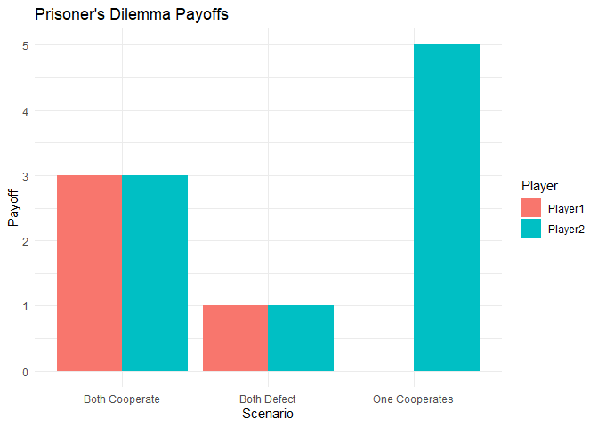

Game Theory Basics
================

## Introduction to Game Theory

Game theory is a field of mathematics that studies strategic
interactions among rational decision-makers. It has applications in
economics, political science, biology, computer science, and more.

### Key Concepts

1.  **Players**: The decision-makers in the game.

2.  **Strategies**: The plans of action available to players.

3.  **Payoffs**: The outcomes or rewards players receive based on the
    strategies they choose.

------------------------------------------------------------------------

In a typical game theory model, we have two players denoted as $A$ and
$B$. Each player has a set of strategies available to them. Let’s denote
the strategies for player $A$ as
$S_A = \{s_{A1}, s_{A2}, \ldots, s_{An}\}$ and for player $B$ as
$S_B = \{s_{B1}, s_{B2}, \ldots, s_{Bm}\}$, where $n$ and $m$ are the
number of strategies available to players $A$ and $B$, respectively.

The payoff functions for each player depend on the strategies chosen by
both players and are represented as $u_A(s_{Ai}, s_{Bj})$ for player $A$
and $u_B(s_{Ai}, s_{Bj})$ for player $B$. Here, $u_A$ and $u_B$ denote
the payoff functions for players $A$ and $B$, respectively, and
$s_{Ai} \in S_A$, $s_{Bj} \in S_B$.

### Types of Games

1.  **Cooperative vs Non-cooperative**: In cooperative games, players
    can form coalitions and make binding agreements. In non-cooperative
    games, binding agreements are not possible.

2.  **Symmetric vs Asymmetric**: In symmetric games, the payoffs for
    playing a particular strategy depend only on the other strategies
    played, not on who is playing them. In asymmetric games, payoffs can
    differ for different players.

3.  **Zero-sum vs Non-zero-sum**: In zero-sum games, one player’s gain
    is another player’s loss. In non-zero-sum games, it is possible for
    all players to gain or lose.

### Nash Equilibrium

A Nash Equilibrium is a situation in which no player can benefit by
changing strategies while the other players keep theirs unchanged. In
the Prisoner’s Dilemma, the Nash Equilibrium is for both players to
defect, even though both would be better off if they both cooperated.

A Nash Equilibrium is a condition where no player can gain by changing
their strategy while the other player keeps theirs unchanged.
Mathematically, a strategy pair $(s_{Ai}^*, s_{Bj}^*)$ is at Nash
Equilibrium if:

$$
u_A(s_{Ai}^*, s_{Bj}^*) \geq u_A(s_{Ai}, s_{Bj}^*) , \forall s_{Ai} \in S_A
$$

$$
u_B(s_{Ai}^*, s_{Bj}^*) \geq u_B(s_{Ai}^*, s_{Bj}) , \forall s_{Bj} \in S_B
$$

This implies that given player $B$ is playing strategy $s_{Bj}^*$,
player $A$ cannot improve their payoff by unilaterally changing their
strategy from $s_{Ai}^*$ to any other strategy in $S_A$. Similarly, for
player $B$, given player $A$ is playing strategy $s_{Ai}^*$.

## The Prisoner’s Dilemma

One of the most famous examples in game theory is the Prisoner’s
Dilemma. Here, two individuals are arrested, but the police have
insufficient evidence for a conviction. The police separate the
prisoners and offer each the same deal: if one testifies against the
other (defects) and the other remains silent (cooperates), the betrayer
goes free, and the silent accomplice receives the full sentence. If both
stay silent, both are sentenced to a short time in jail. If both betray,
both receive a moderate sentence.

The payoff matrix can be represented as:

$$
\begin{array}{c|c|c}
& \text{Cooperate} & \text{Defect} \\
\hline
\text{Cooperate} & (R, R) & (S, T) \\
\hline
\text{Defect} & (T, S) & (P, P) \\
\end{array}
$$

Where:

- $T$ (Temptation) is the payoff for defecting against a cooperating
  player.
- $R$ (Reward) is the payoff for both cooperating.
- $P$ (Punishment) is the payoff for both defecting.
- $S$ (Sucker’s payoff) is the payoff for cooperating against a
  defecting player.

Here, the Nash Equilibrium is $(D, D)$, where both players choose to
defect. The only Nash Equilibrium is when both players choose to defect.
Although cooperating might be better for both players collectively, it
is not a Nash Equilibrium because if one player decides to cooperate,
the best response for the other player is to defect.

``` r
library(tidyverse)
```

    ## ── Attaching core tidyverse packages ──────────────────────── tidyverse 2.0.0 ──
    ## ✔ dplyr     1.1.2     ✔ readr     2.1.4
    ## ✔ forcats   1.0.0     ✔ stringr   1.5.0
    ## ✔ ggplot2   3.4.2     ✔ tibble    3.2.1
    ## ✔ lubridate 1.9.2     ✔ tidyr     1.3.0
    ## ✔ purrr     1.0.1     
    ## ── Conflicts ────────────────────────────────────────── tidyverse_conflicts() ──
    ## ✖ dplyr::filter() masks stats::filter()
    ## ✖ dplyr::lag()    masks stats::lag()
    ## ℹ Use the conflicted package (<http://conflicted.r-lib.org/>) to force all conflicts to become errors

``` r
payoff_matrix <- matrix(c(3, 0, 5, 1), nrow = 2, byrow = TRUE)
colnames(payoff_matrix) <- c("Cooperate", "Defect")
rownames(payoff_matrix) <- c("Cooperate", "Defect")
```

``` r
simulate_game <- function(player1_decision, player2_decision) {
  payoff <- payoff_matrix[player1_decision, player2_decision]
  payoff[2] <- payoff_matrix[player2_decision, player1_decision]
  return(payoff)
}
```

``` r
# Both Cooperate
both_cooperate <- simulate_game("Cooperate", "Cooperate")

# Both Defect
both_defect <- simulate_game("Defect", "Defect")

# Player 1 Cooperates, Player 2 Defects
one_cooperates <- simulate_game("Cooperate", "Defect")

# Store the results in a data frame for visualization
results <- data.frame(Scenario = c("Both Cooperate", "Both Defect", "One Cooperates"),
                      Payoff_Player1 = c(both_cooperate[1], both_defect[1], one_cooperates[1]),
                      Payoff_Player2 = c(both_cooperate[2], both_defect[2], one_cooperates[2]))
```

``` r
results %>% 
  pivot_longer(cols = starts_with('Payoff'), 
               names_to = 'player',
               values_to = 'payoff') %>% 
  mutate(player = str_replace(player, "Payoff_", "")) %>%
  ggplot(aes(x = Scenario, y = payoff, fill = player)) +
  geom_bar(stat = "identity", position = "dodge") +
  labs(title = "Prisoner's Dilemma Payoffs", x = "Scenario", y = "Payoff",
       fill = "Player") +
  theme_minimal()
```

<!-- -->

### With Learning
