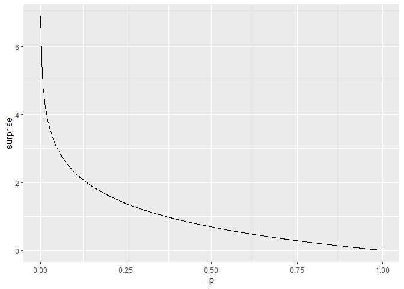
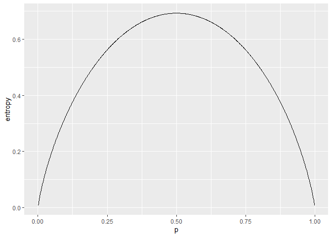
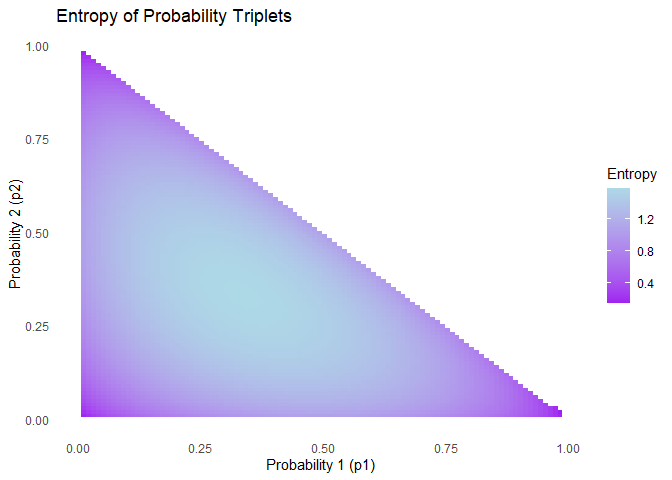

info_theory
================
Benjamin Panny
2024-02-07

``` r
library(tidyverse)
```

    ## ── Attaching core tidyverse packages ──────────────────────── tidyverse 2.0.0 ──
    ## ✔ dplyr     1.1.2     ✔ readr     2.1.4
    ## ✔ forcats   1.0.0     ✔ stringr   1.5.0
    ## ✔ ggplot2   3.4.2     ✔ tibble    3.2.1
    ## ✔ lubridate 1.9.2     ✔ tidyr     1.3.0
    ## ✔ purrr     1.0.1     
    ## ── Conflicts ────────────────────────────────────────── tidyverse_conflicts() ──
    ## ✖ dplyr::filter() masks stats::filter()
    ## ✖ dplyr::lag()    masks stats::lag()
    ## ℹ Use the conflicted package (<http://conflicted.r-lib.org/>) to force all conflicts to become errors

``` r
p <- seq(0.001, 1, by = .001)
inf <- tibble(p = p, surprise = -log(p))
inf %>% 
  ggplot(aes(x = p, y = surprise)) +
  geom_line()
```

<!-- -->

``` r
p <- seq(0.001, .999, by = .001)
inf <- tibble(p = p, entropy = -p*log(p)-(1-p)*log(1-p))
inf %>% 
  ggplot(aes(x = p, y = entropy)) +
  geom_line()
```

<!-- -->

``` r
step_size <- 0.01
generate_triplets_no_zeros <- function(step_size) {
  triplets <- expand.grid(a = seq(step_size, 1 - 2 * step_size, by = step_size),
                          b = seq(step_size, 1 - 2 * step_size, by = step_size)) %>%
    rowwise() %>%
    mutate(c = 1 - a - b) %>%
    filter(c > 0)
  
  return(as.matrix(triplets[, c("a", "b", "c")]))
}

entropy <- function(p) {
  -sum(p * log2(p))
}

triplets <- generate_triplets_no_zeros(step_size)
entropies <- apply(triplets, 1, entropy)

dat <- tibble(p1 = triplets[, 'a'], p2 = triplets[, 'b'], p3 = triplets[, 'c'], entropy = entropies)

# Plot
ggplot(dat, aes(x = p1, y = p2, fill = entropy)) +
  geom_raster() +
  scale_fill_gradient(low = "purple", high = "lightblue", name = "Entropy") +
  labs(x = "Probability 1 (p1)", y = "Probability 2 (p2)", title = "Entropy of Probability Triplets") +
  theme_minimal() +
  theme(panel.grid.major = element_blank(), panel.grid.minor = element_blank())
```

<!-- -->
