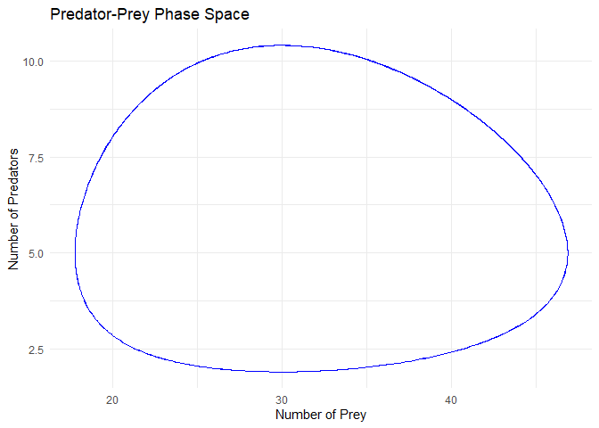

Predator-Prey Simulation with Lotka-Volterra Equations
================
Benjamin Panny
2024-01-22

## Lotka-Volterra Equations

The Lotka-Volterra equations, used to simulate predator-prey
interactions, are a pair of first-order, non-linear, differential
equations. They describe the dynamics of biological systems where two
species interact, one as a predator and the other as prey:

$$
\frac{dP}{dt} = \alpha P - \beta P H
$$

$$
\frac{dH}{dt} = -\gamma H + \delta P H
$$

where:

- $P$ is the number of preys (e.g., rabbits),
- $H$ is the number of predators (e.g., foxes),
- $\frac{dP}{dt}$ and $\frac{dH}{dt}$ represent the growth rates of prey
  and predator populations,
- $\alpha, \beta, \gamma,$ and $\delta$ are positive real constants that
  describe the interaction of the two species.

The phase space plot shows the trajectories of both species in a graph,
with the number of prey as the x-axis and the number of predators as the
y-axis.

``` r
library(deSolve)
```

    ## Warning: package 'deSolve' was built under R version 4.3.2

``` r
library(ggplot2)

# Lotka-Volterra Model
lotka_volterra <- function(t, state, parameters) {
  with(as.list(c(state, parameters)), {
    dP <- alpha * P - beta * P * H
    dH <- -gamma * H + delta * P * H
    list(c(dP, dH))
  })
}

# Parameters
params <- c(alpha = 0.1,  # Prey birth rate
            beta = 0.02,  # Prey death rate per predator
            gamma = 0.3,  # Predator death rate
            delta = 0.01) # Predator birth rate per prey

# Initial State
state <- c(P = 40,  # Initial prey population
           H = 9)   # Initial predator population

# Time
times <- seq(0, 200, by = 0.1)

# Solving the differential equations
out <- ode(y = state, times = times, func = lotka_volterra, parms = params)

# Creating a data frame for plotting
out_df <- as.data.frame(out)
colnames(out_df)[2:3] <- c("Prey", "Predators")

# Plotting the phase space
phase_space_plot <- ggplot(out_df, aes(x = Prey, y = Predators)) +
  geom_path(color = "blue") +
  theme_minimal() +
  labs(title = "Predator-Prey Phase Space",
       x = "Number of Prey",
       y = "Number of Predators")

print(phase_space_plot)
```

<!-- -->
