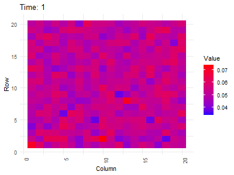

Markov Chains
================
Benjamin Panny
2024-02-02

# Markov Chains

$$
V_1 = V_0 T
$$

``` r
nrows <- 20
ncols <- nrows # square matrix


tmat <- matrix(abs(rnorm(nrows * ncols)), ncol=ncols, byrow=T)
tmat <- tmat / rowSums(tmat)
tmats <- lapply(as.list(seq(0, 20, 1)), function(x){
  if (x %% 1) {return(tmat%^%x)}
  else {
    newmat <- matrix(abs(rbinom(nrows * ncols, 100, .5)), ncol=ncols, byrow=T)
    newmat <- newmat / rowSums(newmat)
    return(tmat * newmat + newmat)
  }
})

# tmats
```

``` r
library(tidyverse)
```

    ## ── Attaching core tidyverse packages ──────────────────────── tidyverse 2.0.0 ──
    ## ✔ dplyr     1.1.2     ✔ readr     2.1.4
    ## ✔ forcats   1.0.0     ✔ stringr   1.5.0
    ## ✔ ggplot2   3.4.2     ✔ tibble    3.2.1
    ## ✔ lubridate 1.9.2     ✔ tidyr     1.3.0
    ## ✔ purrr     1.0.1     
    ## ── Conflicts ────────────────────────────────────────── tidyverse_conflicts() ──
    ## ✖ dplyr::filter() masks stats::filter()
    ## ✖ dplyr::lag()    masks stats::lag()
    ## ℹ Use the conflicted package (<http://conflicted.r-lib.org/>) to force all conflicts to become errors

``` r
data <- map_df(seq_along(tmats), ~as.data.frame(tmats[[.x]]) %>%
                   mutate(Time = .x, Row = row_number()) %>%
                   pivot_longer(cols = -c(Time, Row), names_to = "Column", values_to = "Value") %>%
                   mutate(Column = as.numeric(gsub("V", "", Column))))  # Convert Column names to numeric
```

``` r
library(gganimate)
```

    ## Warning: package 'gganimate' was built under R version 4.3.2

``` r
library(gifski)
```

    ## Warning: package 'gifski' was built under R version 4.3.2

``` r
p <- ggplot(data, aes(x = Column, y = Row, fill = Value)) + 
    geom_tile() +  # Use geom_tile for matrix visualization
    scale_fill_gradient(low = "blue", high = "red") +  # Color gradient
    theme_minimal() + 
    theme(axis.text.x = element_text(angle = 90, hjust = 1)) +
    labs(title = 'Time: {frame_time}', x = 'Column', y = 'Row') +
    transition_time(Time) + 
    ease_aes('linear')

# Render the animation
anim <- animate(p, nframes = 200, duration = 10, width = 400, height = 300, renderer = gifski_renderer())
anim_save("matrix_animation_binom.gif", anim)
anim
```

<!-- -->
