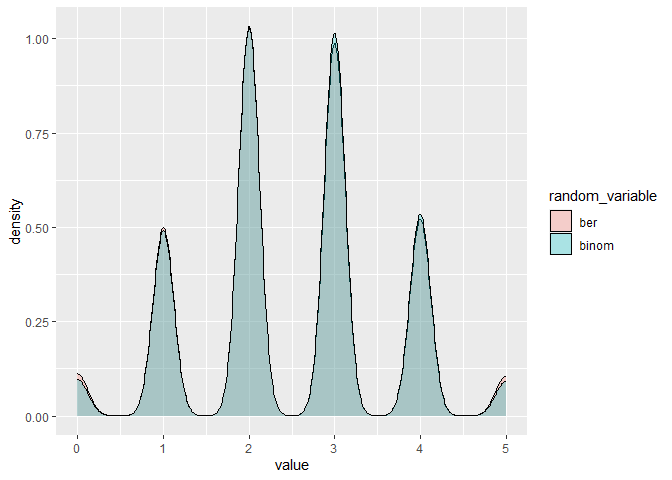

Relationships among probability distributions
================
Benjamin Panny
2024-02-21

<figure>

<figcaption aria-hidden="true">Relationships among univariate
probability distributions</figcaption>
</figure>

``` r
library(tidyverse)
```

    ## ── Attaching core tidyverse packages ──────────────────────── tidyverse 2.0.0 ──
    ## ✔ dplyr     1.1.2     ✔ readr     2.1.4
    ## ✔ forcats   1.0.0     ✔ stringr   1.5.0
    ## ✔ ggplot2   3.4.2     ✔ tibble    3.2.1
    ## ✔ lubridate 1.9.2     ✔ tidyr     1.3.0
    ## ✔ purrr     1.0.1     
    ## ── Conflicts ────────────────────────────────────────── tidyverse_conflicts() ──
    ## ✖ dplyr::filter() masks stats::filter()
    ## ✖ dplyr::lag()    masks stats::lag()
    ## ℹ Use the conflicted package (<http://conflicted.r-lib.org/>) to force all conflicts to become errors

The binomial distribution is the sum of bernoulli trials of size n

``` r
dat <- numeric()
for (i in 1:5000){
  val <- 0
  for (j in 1:5){
    val <- val + rbinom(1, 1, .5)
  }
  dat[i] <- val
}

dat <- tibble(ber = dat, binom = rbinom(5000, 5, .5))
dat %>% 
  pivot_longer(everything(), names_to = 'random_variable', values_to = "value") %>% 
  ggplot(aes(x = value, fill = random_variable)) +
  geom_density(alpha = .3)
```

<!-- -->
