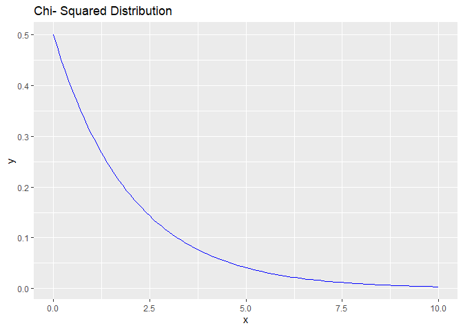
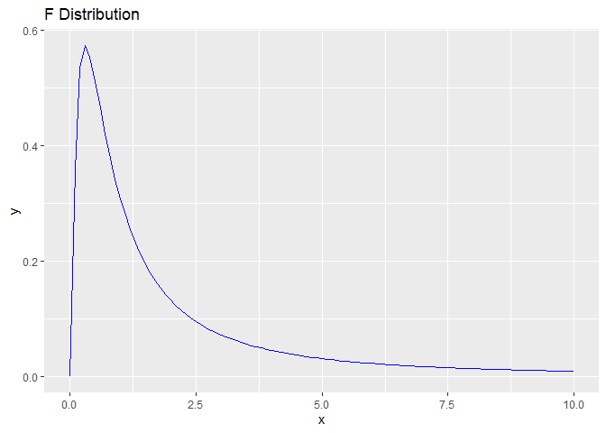
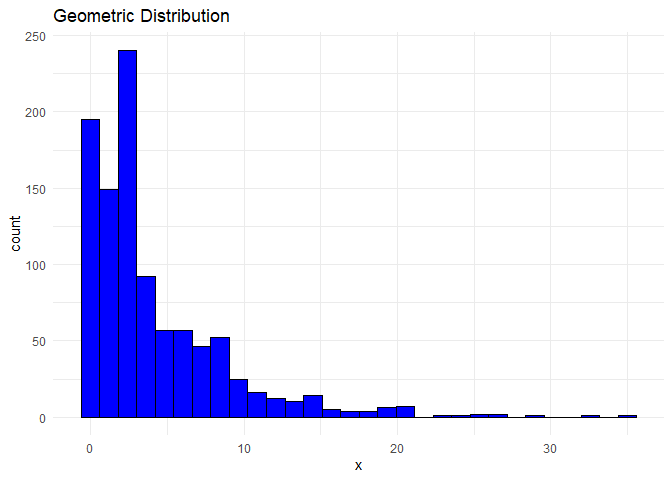

Probability Distributions
================
Benjamin Panny
2024-02-24

# Load the ggplot2 package

library(ggplot2)

# Function to plot a given distribution

``` r
plot_distribution <-  function(dist_name, params = list(), xlim = c(- 10, 10), title = "") {
  ggplot(data = data.frame(x = 0), mapping = aes(x = x)) +
    geom_function(fun = match.fun(paste("d", dist_name, sep = "")), args = params, color = "blue") +
    xlim(xlim) +
    ggtitle(title)
}
```

# Continuous Distributions

## Beta Distribution

``` r
plot_distribution("beta", params = list(shape1 = 2, shape2 = 5), title = "Beta Distribution")
```

<!-- -->

## Cauchy Distribution

``` r
plot_distribution("cauchy", params = list(location = 0, scale = 1), title = "Cauchy Distribution")
```

<!-- -->

## Chi- Squared Distribution

``` r
plot_distribution("chisq", params = list(df = 2), xlim = c(0, 10), title = "Chi- Squared Distribution")
```

<!-- -->

## Exponential Distribution

``` r
plot_distribution("exp", params = list(rate = 1), xlim = c(0, 10), title = "Exponential Distribution")
```

<!-- -->

## F Distribution

``` r
plot_distribution("f", params = list(df1 = 5, df2 = 2), xlim = c(0, 10), title = "F Distribution")
```

<!-- -->

## Gamma Distribution

``` r
plot_distribution("gamma", params = list(shape = 2, rate = 1), title = "Gamma Distribution")
```

<!-- -->
\## Log- Normal Distribution

``` r
plot_distribution("lnorm", params = list(meanlog = 0, sdlog = 1), xlim = c(0, 10), title = "Log Normal Distribution")
```

<!-- -->

## Logistic Distribution

``` r
plot_distribution("logis", params = list(location = 0, scale = 1), title = "Logistic Distribution")
```

<!-- -->

## Student t Distribution

``` r
plot_distribution("t", params = list(df = 5), title = "Student t Distribution")
```

<!-- -->

## Uniform Distribution

``` r
plot_distribution("unif", params = list(min = - 5, max = 5), title = "Uniform Distribution")
```

<!-- -->

## Weibull Distribution

``` r
plot_distribution("weibull", params = list(shape = 2, scale = 1), xlim = c(0, 10), title = "Weibull Distribution")
```

<!-- -->

## Non- central Chi- Squared Distribution

``` r
# plot_distribution("nchisq", params = list(df = 2, ncp = 0), xlim = c(0, 10), title = "Non- central Chi- Squared Distribution")
```

# Studentized Range Distribution

Under construction

# Discrete Distributions

``` r
plot_distribution_discrete <-  function(dist_name, params = list(), n = 1000, bins = 30, title = "") {
  # Generate a sample from the distribution
  sample_data <-  do.call(paste("r", dist_name, sep = ""), c(list(n = n), params))
  
  # Create a data frame for ggplot
  data <-  data.frame(x = sample_data)
  
  # Plot the histogram
  ggplot(data, aes(x = x)) +
    geom_histogram(bins = bins, fill = "blue", color = "black") +
    ggtitle(title) +
    theme_minimal()
}
```

# Binomial Distribution

``` r
plot_distribution_discrete("binom", params = list(size = 10, prob = 0.5), title = "Binomial Distribution")
```

<!-- -->

# Geometric Distribution

``` r
plot_distribution_discrete("geom", params = list(prob = 0.2), title = "Geometric Distribution")
```

<!-- -->

# Negative Binomial Distribution

``` r
plot_distribution_discrete("nbinom", params = list(size = 10, prob = 0.5), title = "Negative Binomial Distribution")
```

<!-- -->

# Poisson Distribution

``` r
plot_distribution_discrete("pois", params = list(lambda = 2), title = "Poisson Distribution")
```

<!-- -->

# Probability Distribution Details

This section provides the formulas for the PDF/PMF, expectation,
variance, and MGF of the distributions covered.

## Logistic Distribution

``` r
plot_distribution("logis", params = list(location = 0, scale = 1), title = "Logistic Distribution")
```

<!-- -->

## Student t Distribution

``` r
plot_distribution("t", params = list(df = 5), title = "Student t Distribution")
```

<!-- -->

## Uniform Distribution

``` r
plot_distribution("unif", params = list(min = - 5, max = 5), title = "Uniform Distribution")
```

<!-- -->

## Weibull Distribution

``` r
plot_distribution("weibull", params = list(shape = 2, scale = 1), xlim = c(0, 10), title = "Weibull Distribution")
```

<!-- -->

## Non- central Chi- Squared Distribution

``` r
# plot_distribution("nchisq", params = list(df = 2, ncp = 0), xlim = c(0, 10), title = "Non- central Chi- Squared Distribution")
```

# Studentized Range Distribution

# Note: Studentized Range distribution is not directly supported in ggplot2’s geom_function.

# You might need to use a custom function or dataset to plot this distribution.

# Discrete Distributions

``` r
plot_distribution_discrete <-  function(dist_name, params = list(), n = 1000, bins = 30, title = "") {
  # Generate a sample from the distribution
  sample_data <-  do.call(paste("r", dist_name, sep = ""), c(list(n = n), params))
  
  # Create a data frame for ggplot
  data <-  data.frame(x = sample_data)
  
  # Plot the histogram
  ggplot(data, aes(x = x)) +
    geom_histogram(bins = bins, fill = "blue", color = "black") +
    ggtitle(title) +
    theme_minimal()
}
```

# Binomial Distribution

``` r
plot_distribution_discrete("binom", params = list(size = 10, prob = 0.5), title = "Binomial Distribution")
```

<!-- -->

# Geometric Distribution

``` r
plot_distribution_discrete("geom", params = list(prob = 0.2), title = "Geometric Distribution")
```

<!-- -->

# Negative Binomial Distribution

``` r
plot_distribution_discrete("nbinom", params = list(size = 10, prob = 0.5), title = "Negative Binomial Distribution")
```

<!-- -->

# Poisson Distribution

``` r
plot_distribution_discrete("pois", params = list(lambda = 2), title = "Poisson Distribution")
```

<!-- -->

# Probability Distribution Details

This section provides the formulas for the PDF/PMF, expectation,
variance, and MGF of the distributions covered.

## Continuous Distributions

### Beta Distribution

- PDF:
  $f(x; \alpha, \beta) = \frac{x^{\alpha- 1}(1- x)^{\beta- 1}}{B(\alpha, \beta)}$
  for $0 < x < 1$
- Expectation: $E(X) = \frac{\alpha}{\alpha + \beta}$
- Variance:
  $Var(X) = \frac{\alpha\beta}{(\alpha+\beta)^2(\alpha+\beta+1)}$
- MGF: Not available in a simple closed form.
- CF: Not available in a simple closed form.

### Cauchy Distribution

- PDF:
  $f(x; x_0, \gamma) = \frac{1}{\pi\gamma[1 + (\frac{x- x_0}{\gamma})^2]}$
- Expectation: Undefined
- Variance: Undefined
- MGF: Undefined
- CF: $e^{ix_0t - \gamma|t|}$

### Chi-Squared Distribution

- PDF: $f(x; k) = \frac{x^{k/2- 1}e^{- x/2}}{2^{k/2}\Gamma(k/2)}$ for
  $x > 0$
- Expectation: $E(X) = k$
- Variance: $Var(X) = 2k$
- MGF: $(1- 2t)^{- k/2}$ for $t < \frac{1}{2}$
- CF: $(1- 2it)^{- k/2}$

### Exponential Distribution

- PDF: $f(x; \lambda) = \lambda e^{- \lambda x}$ for $x \geq 0$
- Expectation: $E(X) = \frac{1}{\lambda}$
- Variance: $Var(X) = \frac{1}{\lambda^2}$
- MGF: $\frac{\lambda}{\lambda - t}$ for $t < \lambda$
- CF: $\frac{\lambda}{\lambda - it}$

### F Distribution

- PDF:
  $f(x; d_1, d_2) = \frac{\sqrt{\frac{(d_1x)^{d_1}d_2^{d_2}}{(d_1x + d_2)^{d_1+d_2}}}}{xB(d_1/2, d_2/2)}$
  for $x > 0$
- Expectation: $E(X) = \frac{d_2}{d_2- 2}$ for $d_2 > 2$
- Variance: $Var(X) = \frac{2d_2^2(d_1+d_2- 2)}{d_1(d_2- 2)^2(d_2- 4)}$
  for $d_2 > 4$
- MGF: Not available in a simple closed form.
- CF: Not typically provided due to the complexity of its form.

### Gamma Distribution

- PDF:
  $f(x; k, \theta) = \frac{x^{k- 1}e^{- x/\theta}}{\theta^k\Gamma(k)}$
  for $x > 0$
- Expectation: $E(X) = k\theta$
- Variance: $Var(X) = k\theta^2$
- MGF: $(1 - \theta t)^{- k}$ for $t < \frac{1}{\theta}$
- CF: $(1 - i\theta t)^{- k}$

### Log-Normal Distribution

- PDF:
  $f(x; \mu, \sigma) = \frac{1}{x\sigma\sqrt{2\pi}}e^{- \frac{(\ln x - \mu)^2}{2\sigma^2}}$
  for $x > 0$
- Expectation: $E(X) = e^{\mu + \sigma^2/2}$
- Variance: $Var(X) = (e^{\sigma^2} - 1)e^{2\mu + \sigma^2}$
- MGF: Not defined for $t$ in the real domain.
- CF: $e^{i\mu t - \frac{1}{2}\sigma^2 t^2}$

### Logistic Distribution

- PDF: $f(x; \mu, s) = \frac{e^{- (x- \mu)/s}}{s[1+e^{- (x- \mu)/s}]^2}$
- Expectation: $E(X) = \mu$
- Variance: $Var(X) = \frac{s^2\pi^2}{3}$
- MGF: Not typically provided.
- CF: Not typically provided. Student \### t Distribution
- PDF:
  $f(x; \nu) = \frac{\Gamma((\nu+1)/2)}{\sqrt{\nu\pi}\Gamma(\nu/2)}(1+\frac{x^2}{\nu})^{- (\nu+1)/2}$
- Expectation: $E(X) = 0$ for $\nu > 1$
- Variance: $Var(X) = \frac{\nu}{\nu- 2}$ for $\nu > 2$
- MGF: Not defined.
- CF: Not available in a simple closed form.

### Uniform Distribution

- PDF: $f(x; a, b) = \frac{1}{b- a}$ for $a \leq x \leq b$
- Expectation: $E(X) = \frac{a+b}{2}$
- Variance: $Var(X) = \frac{(b- a)^2}{12}$
- MGF: $\frac{e^{bt} - e^{at}}{t(b- a)}$ for $t \neq 0$
- CF: $\frac{e^{ibt} - e^{iat}}{ibt - iat}$

### Weibull Distribution

- PDF:
  $f(x; k, \lambda) = \frac{k}{\lambda}(\frac{x}{\lambda})^{k- 1}e^{- (x/\lambda)^k}$
  for $x \geq 0$
- Expectation: $E(X) = \lambda\Gamma(1 + \frac{1}{k})$
- Variance:
  $Var(X) = \lambda^2[\Gamma(1 + \frac{2}{k}) - (\Gamma(1 + \frac{1}{k}))^2]$
- MGF: Not available in a simple closed form.
- CF: Not typically provided due to its complexity.

## Discrete Distributions

### Binomial Distribution

- PMF: $P(X = k) = \binom{n}{k}p^k(1- p)^{n- k}$
- Expectation: $E(X) = np$
- Variance: $Var(X) = np(1- p)$
- MGF: $(1- p + pe^t)^n$
- CF: $(1- p + pe^{it})^n$

### Geometric Distribution

- PMF: $P(X = k) = (1- p)^{k- 1}p$
- Expectation: $E(X) = \frac{1}{p}$
- Variance: $Var(X) = \frac{1- p}{p^2}$
- MGF: $\frac{pe^t}{1- (1- p)e^t}$ for $t < - \ln(1- p)$
- CF: $\frac{p}{1- (1- p)e^{it}}$

### Negative Binomial Distribution

- PMF: $P(X = k) = \binom{k+r- 1}{k}(1- p)^rp^k$
- Expectation: $E(X) = \frac{rp}{1- p}$
- Variance: $Var(X) = \frac{rp}{(1- p)^2}$
- MGF: Not available in a simple closed form.
- CF: Not available in a simple closed form.

### Poisson Distribution

- PMF: $P(X = k) = \frac{\lambda^k e^{- \lambda}}{k!}$
- Expectation: $E(X) = \lambda$
- Variance: $Var(X) = \lambda$
- MGF: $e^{\lambda(e^t- 1)}$
- CF: $e^{\lambda(e^{it}- 1)}$

### Logistic Distribution

- PDF: $f(x; \mu, s) = \frac{e^{- (x- \mu)/s}}{s[1+e^{- (x- \mu)/s}]^2}$
- Expectation: $E(X) = \mu$
- Variance: $Var(X) = \frac{s^2\pi^2}{3}$
- MGF: Not typically provided.
- CF: Not typically provided.

### Student t Distribution

- PDF:
  $f(x; \nu) = \frac{\Gamma((\nu+1)/2)}{\sqrt{\nu\pi}\Gamma(\nu/2)}(1+\frac{x^2}{\nu})^{- (\nu+1)/2}$
- Expectation: $E(X) = 0$ for $\nu > 1$
- Variance: $Var(X) = \frac{\nu}{\nu- 2}$ for $\nu > 2$
- MGF: Not defined.
- CF: Not available in a simple closed form.

### Uniform Distribution

- PDF: $f(x; a, b) = \frac{1}{b- a}$ for $a \leq x \leq b$
- Expectation: $E(X) = \frac{a+b}{2}$
- Variance: $Var(X) = \frac{(b- a)^2}{12}$
- MGF: $\frac{e^{bt} - e^{at}}{t(b- a)}$ for $t \neq 0$
- CF: $\frac{e^{ibt} - e^{iat}}{ibt - iat}$

### Weibull Distribution

- PDF:
  $f(x; k, \lambda) = \frac{k}{\lambda}(\frac{x}{\lambda})^{k- 1}e^{- (x/\lambda)^k}$
  for $x \geq 0$
- Expectation: $E(X) = \lambda\Gamma(1 + \frac{1}{k})$
- Variance:
  $Var(X) = \lambda^2[\Gamma(1 + \frac{2}{k}) - (\Gamma(1 + \frac{1}{k}))^2]$
- MGF: Not available in a simple closed form.
- CF: Not typically provided due to its complexity.

## Discrete Distributions

### Binomial Distribution

- PMF: $P(X = k) = \binom{n}{k}p^k(1- p)^{n- k}$
- Expectation: $E(X) = np$
- Variance: $Var(X) = np(1- p)$
- MGF: $(1- p + pe^t)^n$
- CF: $(1- p + pe^{it})^n$

### Geometric Distribution

- PMF: $P(X = k) = (1- p)^{k- 1}p$
- Expectation: $E(X) = \frac{1}{p}$
- Variance: $Var(X) = \frac{1- p}{p^2}$
- MGF: $\frac{pe^t}{1- (1- p)e^t}$ for $t < - \ln(1- p)$
- CF: $\frac{p}{1- (1- p)e^{it}}$

### Negative Binomial Distribution

- PMF: $P(X = k) = \binom{k+r- 1}{k}(1- p)^rp^k$
- Expectation: $E(X) = \frac{rp}{1- p}$
- Variance: $Var(X) = \frac{rp}{(1- p)^2}$
- MGF: Not available in a simple closed form.
- CF: Not available in a simple closed form.

### Negative Binomial Distribution

- PMF: $P(X = k) = \binom{k+r- 1}{k}(1- p)^rp^k$
- Expectation: $E(X) = \frac{rp}{1- p}$
- Variance: $Var(X) = \frac{rp}{(1- p)^2}$
- MGF: Does not have a simple closed form.

### Poisson Distribution

- PMF: $P(X = k) = \frac{\lambda^k e^{- \lambda}}{k!}$
- Expectation: $E(X) = \lambda$
- Variance: $Var(X) = \lambda$
- MGF: $e^{\lambda(e^t- 1)}$
- CF: $e^{\lambda(e^{it}- 1)}$
